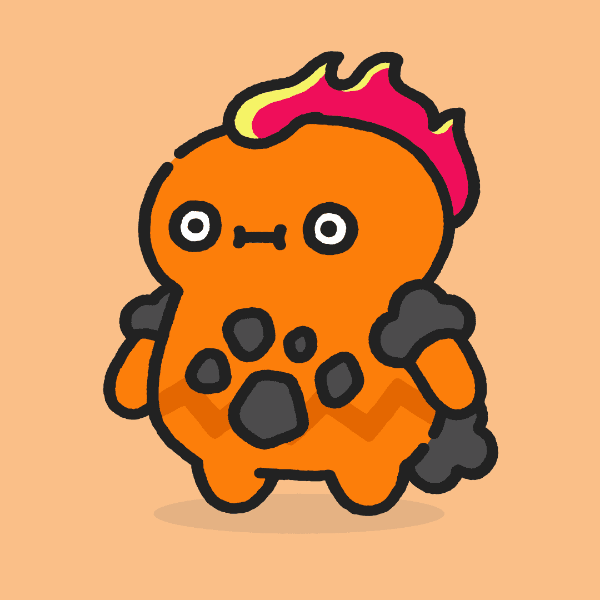

# Cool Pets

作为 Cool Cats 品牌的 NFT 产品，Pets 是 19,999 个 NFT 的集合，这些 NFT 是基于项目交互程序生成的。所有宠物都从蛋开始，然后演变成最终形式，代表四种元素之一：草、火、水或空气。用户可以通过我们在coolcatsnft.com 上的游戏化体验进化他们的宠物——您的最终宠物是1700 万种可能结果之一！要了解有关宠物、彩蛋和 Cooltopia 世界的更多信息，请访问cooltopia.coolcatsnft.com。我们爱宠物！

Cool Cats 是以太坊区块链上以编程方式随机生成的 NFT 集合。第一代由超过 300,000 个选项中的 9,999 只随机组装的猫组成。酷猫有各种各样的服装、面孔和颜色。每只酷猫都由独特的身体、帽子、脸和服装组成——几乎无限可能！所有的猫都很酷，但穿着完整的猫是最酷的。

