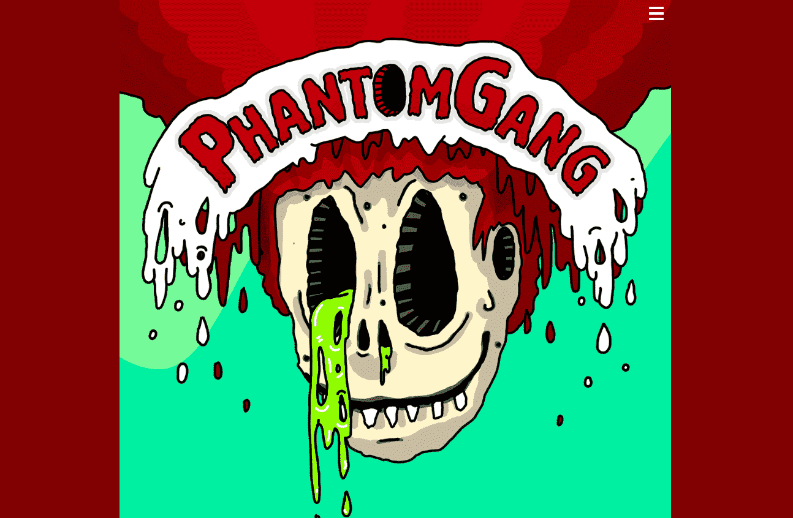

# PhantomGang

悬挂的、肮脏的绿色雾云散布在地球背面的一个后世界末日、布满粘液的沼泽上。

燃烧的天空之火消失在弯曲的地平线后面，幻影帮的成员从前千年的灰暗腐烂中脱颖而出。

这些对生命最后的嘲弄现在在腐臭的鼻涕之地的淤泥中争夺统治地位。

Phantom Gang 拥有 6 个完全不同的 Phantom 品种，每个品种都有 1111 种独特的 Phantom 变体。每个品种都有大量超级稀有的 Phantom。

每个品种都根据六个基本属性之一进行加权。

所有幻影都有固定数量的 888 总点数，分配给所有属性，总点数中的 444 到 666 点随机分配给该品种的一个核心属性。其余的点然后随机分配给其余五个该品种的属性。

