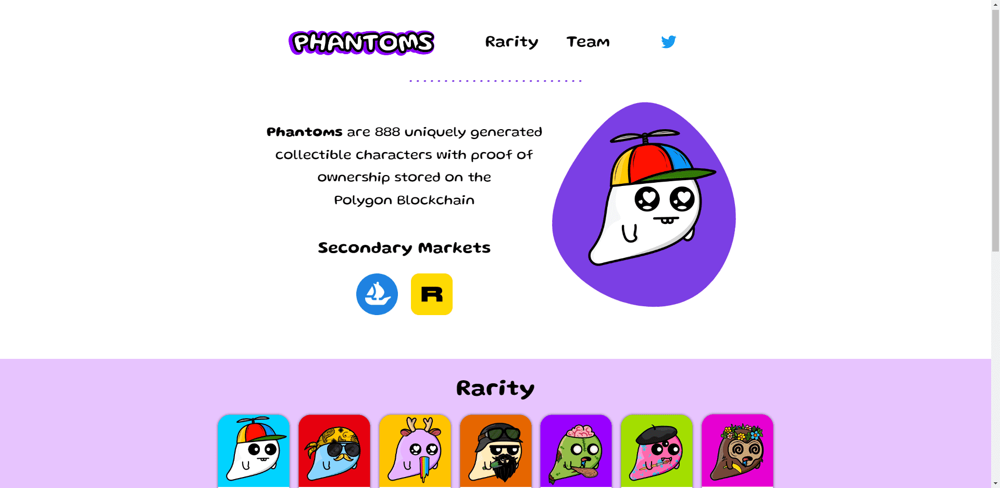

# PHANTOMS NFT - Official Collection

幻影之家！提醒您，如果您是幻影持有者，您还有 6 天时间在我们的 discord 中填写我们的免费服装表格！

幻影是 888 个独特生成的可
收藏角色，其所有权证明
存储在
Polygon 区块链上

什么是 Phantoms NFT？

Phantoms NFT 是一个 NFT（Non-fungible token）集合。存储在区块链上的数字艺术品集合。

Phantoms NFT 代币有多少？

总共有 886 个 Phantoms NFT NFT。目前 161 位所有者的钱包中至少有一个 Phantoms NFT NTF。

最近卖出了多少 Phantoms NFT？

过去 30 天内售出 0 个 Phantoms NFT NFT。

