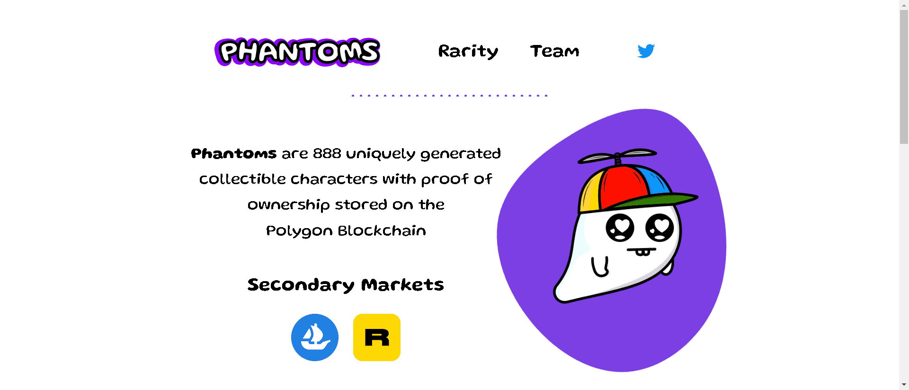

# Phantoms NFT OfficiaI

幻影是 888 个独特生成的可收藏角色，其所有权证明存储在Polygon 区块链上

▶ 什么是 Phantoms NFT？
Phantoms NFT 是一个 NFT（Non-fungible token）集合。存储在区块链上的数字艺术品集合。

▶ Phantoms NFT 代币有多少？
总共有 886 个 Phantoms NFT NFT。目前 161 位所有者的钱包中至少有一个 Phantoms NFT NTF。

