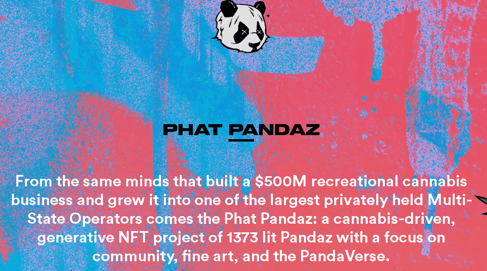

# Phat Pandaz

随机生成 1373 个独特的 Pandaz，以帮助建立一个有意义且有影响力的社区。

Phat Pandaz 出自建立了价值 5 亿美元的休闲大麻业务并将其发展成为最大的私营多国运营商之一的同一头脑：1373 点燃 Pandaz 的大麻驱动、生成式 NFT 项目，专注于社区，很好艺术，和 PandaVerse。

从 2022 年 3 月 1 日起，白金 Pandaz NFT 持有者将能够申领虚拟 Seedz*。每月 1 日，白金持有者将能够领取他们的 Seedz（一年 12 次）。Seedz 也可以兑换成真正的 Seedz（与 Surfr Seeds 合作）或将它们用作 Red/Trash Pandaz 的燃烧机制（更多详细信息即将推出）。

