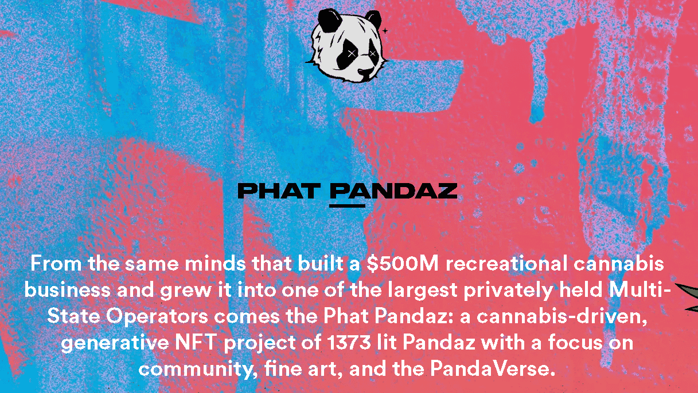

# Phat Pandaz Farms

Phat Pandaz 农场由肥料、Coco Cubez 和 Seedz 组成。收集并燃烧所有 3 件物品以获得植物。

▶ 什么是 Phat Pandaz 农场？
Phat Pandaz Farms 是一个 NFT（非同质代币）集合。存储在区块链上的数字艺术品集合。

▶ 有多少 Phat Pandaz Farms 代币？
总共有 4 个 Phat Pandaz Farms NFT。目前，290 位业主的钱包中至少有一个 Phat Pandaz Farms NTF。

▶ 最昂贵的 Phat Pandaz 农场销售是什么？
Phat Pandaz Farms NFT 出售的最昂贵的是 Plant。它于 2022-07-04（大约 2 个月前）以 153.7 美元的价格售出。

