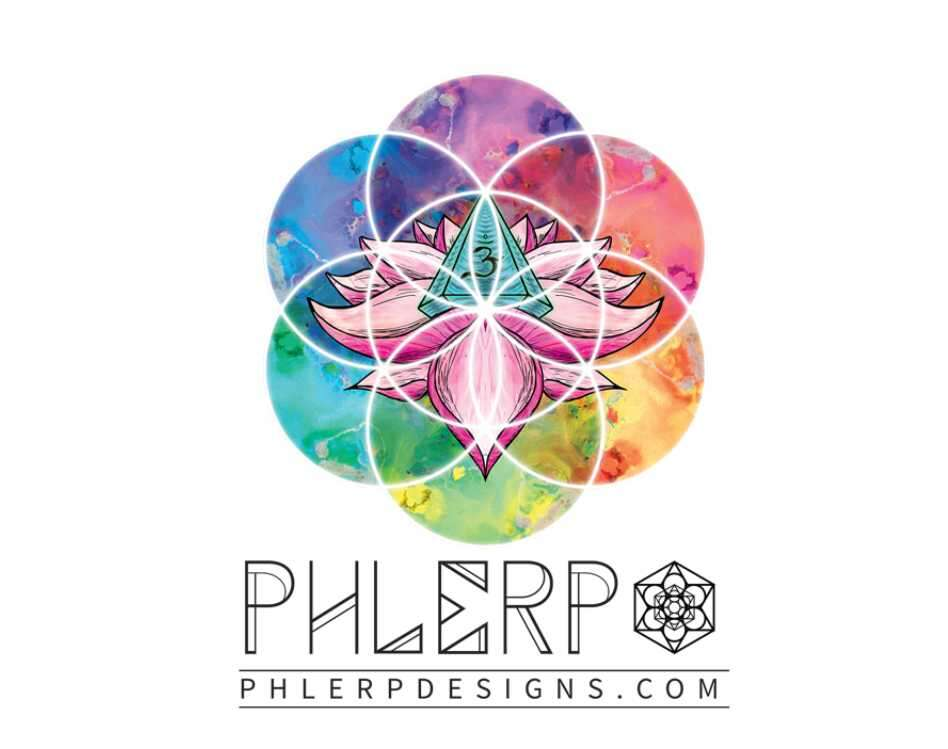

# PHLERP Creative Supporters

该系列的目的是在财务上支持 PHLERP 进一步扩展他的创作技能。这将通过空投利用新发现的技能为持有者提供更大的价值，并在未来的空投中增加技能和价值。此系列中的所有 drop 都将具有特定的课程、工具或程序，以帮助创造性地进一步开发 PHLERP 项目。购买证明和课程更新将提供给持有人。

什么是 PHLERP 创意支持者？

PHLERP Creative Supporters 是一个 NFT（Non-fungible token）集合。存储在区块链上的数字艺术品集合。

有多少 PHLERP Creative Supporters 代币？

总共有 1 个 PHLERP Creative Supporters NFT。目前，10 位所有者的钱包中至少有一个 PHLERP Creative Supporters NTF。

最昂贵的 PHLERP Creative Supporters 销售是什么？

最昂贵的 PHLERP Creative Supporters NFT 是 Western Deity。它于 2022 年 6 月 9 日（3 个月前）以 54.6 美元的价格售出。

最近卖出了多少 PHLERP Creative Supporters？

过去 30 天内售出了 10 个 PHLERP Creative Supporters NFT。

