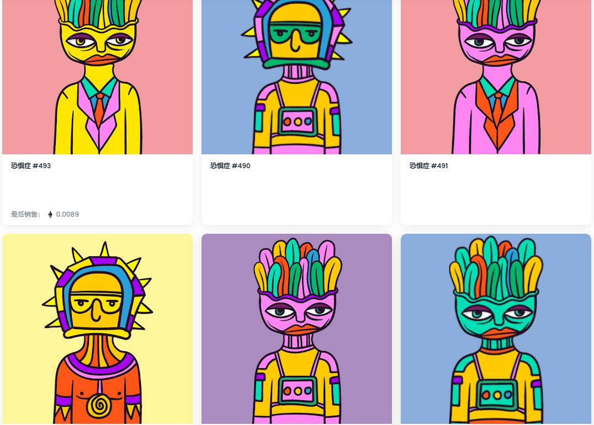

# Phobies

恐惧症已经接管了以太坊区块链，一旦全部被征服，就可以看到它们！立即显示（刷新元数据）

什么是恐惧症？

Phobies 是一个 NFT（不可替代令牌）集合。存储在区块链上的数字艺术品集合。

有多少个 Phobies 代币？

总共有 1,514 个 Phobie NFT。目前，357 位所有者的钱包中至少有一个 Phobies NTF。

最近卖出了多少 Phobie？

过去 30 天内售出 0 个 Phobies NFT。

