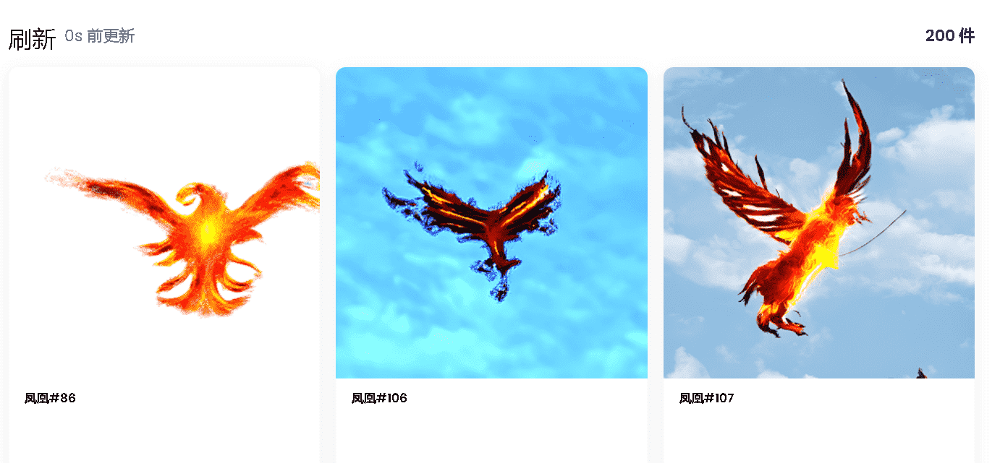

# Phoenix Effect

Phoenix Emblem Alliance 是一个全球团队，旨在通过区块链和游戏赚钱游戏改变世界各地人们的生活。

由于最近在菲律宾发生了台风莱/奥黛特的自然灾害，导致一些城市数周没有互联网和电力，并导致水和食物等必需品短缺。

通过该 NFT 项目产生的所有资金将用于帮助受台风 Rai/Odette 和全球其他灾害影响的人们。我们目前在 6 个不同的国家有传教士，菲律宾、印度尼西亚、印度、巴西、巴基斯坦和委内瑞拉，目前还在不断扩大。

我们不只是为了赚钱，我们是为了付出。

