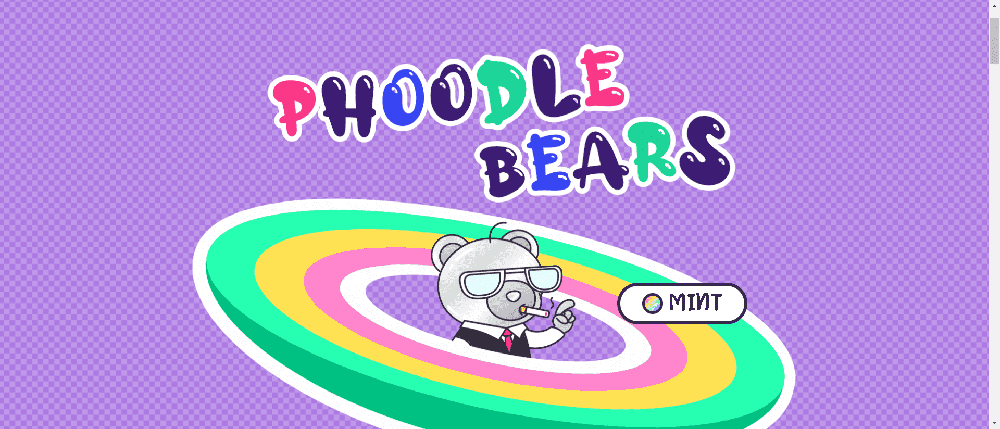

# Phoodle Bears Collection

Phoodle Bears 是一个以社区、协作和实用程序为中心的可收藏 NFT 项目。每个 Phoodle Bear 都作为 NFT 驻留在以太坊区块链上，由特征和底层“皮肤”的独特组合组成。Phoodle Bear NFT 是由目前正在冬眠的 Phoodle Bear 涂鸦的自画像。每个 NFT 都可以作为您在一个世界和令人敬畏的社区中的会员证明，以及解锁 PhoodleVerse 中各个熊的关键。

