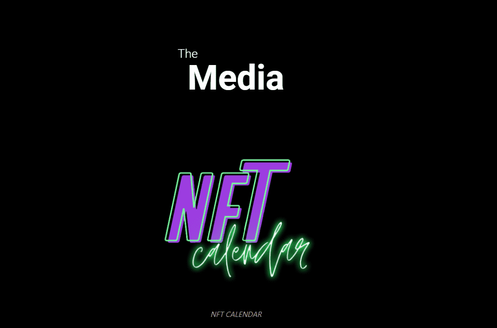

# Phraze

向语言文化致敬。

这是一个 6 位代码艺术项目，具有 6 高 26 变体。这意味着 170 581 728 179 578 208 256 仅与字母组合的可能性。Artcode 将只允许 5K 随机生成的可能性，包括排名。

生成了多少种不同语言的单词？这个奇妙的方面带有一种机制，它将向我们展示美丽和多样性，但也可能是拉丁字母的糟糕语言。

什么是短语？

Phraze 是一个 NFT（不可替代代币）集合。存储在区块链上的数字艺术品集合。

有多少 Phraze 代币？

总共有 4,953 个 Phraze NFT。目前 189 位所有者的钱包中至少有一个 Phraze NTF。

最昂贵的 Phraze 销售是什么？

出售的最昂贵的 Phraze NFT 是 The Phraze #1567。它于 2022-06-20（2 个月前）以 10.8 美元的价格售出。

最近卖出了多少 Phraze？

过去 30 天内售出了 76 个 Phraze NFT。

Phraze 的价格是多少？

在过去 30 天里，最便宜的 Phraze NFT 销售额低于 1 美元，最高销售额超过 4 美元。Phraze NFT 的中位价格在过去 30 天内为 1 美元。

