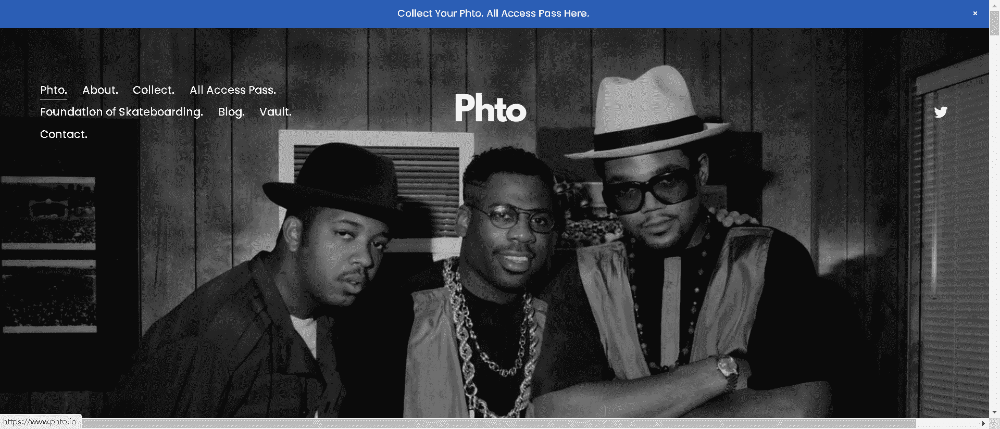

# Phto. Exhibit

照片。很自豪地介绍Pat Johnson 展览，展示 4 年来具有重要文化意义的摇滚、嘻哈和音乐摄影。“展览收藏”是 Phto 的主要 NFT 收藏。该系列中包含的每件作品都是与特色摄影师合作策划的。展览收藏中的版本范围从 1 到 35。为 Metaverse 中最伟大的收藏家授权世界上最好的摄影师的标志性摄影收藏的独家 NFT 权利。

2022 年将是“NFT 摄影年”，也是 Phto 的目标。是向我们的收藏家介绍艺术摄影的综合策展收藏，其中一些是以前从未见过的。我们将世界上最伟大的摄影师带给世界上最伟大的 NFT 收藏家。

