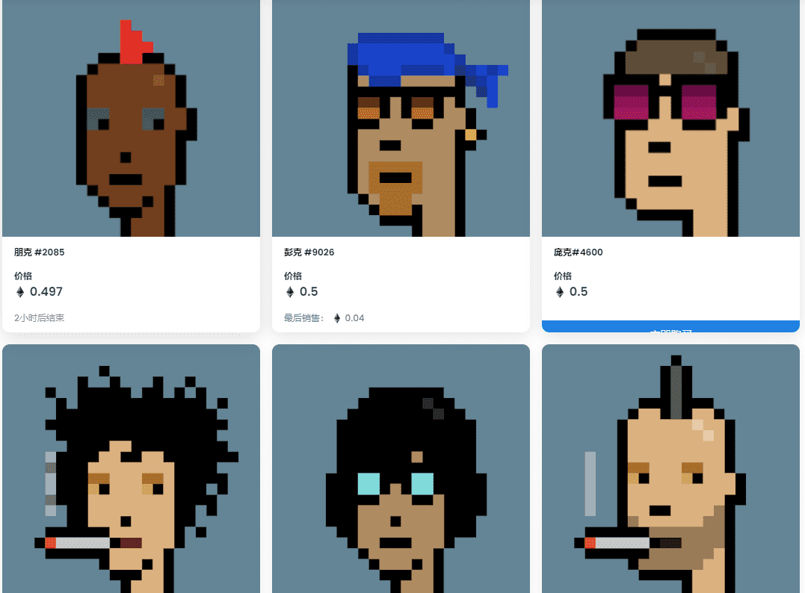

# Phunks

清算的日子到了，男孩是甜蜜的！在从 OpenSea 被驱逐 9 个月之后，大多数 NFT 被买卖（出于某种奇怪的原因），CryptoPhunks 集合再次在平台上上市！2022 年 3 月 24 日，CryptoPhunks 社区律师向 OpenSea发出 DMCA 反通知，该通知已转发给投诉方。在 Larva Labs（最初发布 DMCA）和 Yuga Labs（现在拥有 CryptoPunks IP）的无线电静默 14 个工作日后，Phunk 的律师Krystal Noga-Styron于 2022 年 4 月 13 日爆料称 CryptoPhunks 收藏已被第三次（希望是）最后一次在 OpenSea 上重新上市！

此次重新上架标志着 CryptoPhunks 社区战胜了自该项目开始以来一直在审查和解雇我们的集中权力。CryptoPhunks 社区代表着 web3 真正去中心化和抗审查的未来，最终推翻了针对我们的最恶劣的审查行为，这为社区注入了活力并增强了我们的决心。无论您喜不喜欢，CryptoPhunks 都会留下来！

