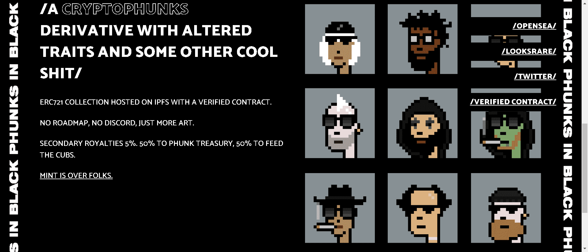

# Phunks In Black

受 MIB 启发的 CryptoPhunks 衍生产品，具有黑暗特征和其他一些很酷的东西。0 版税。加入黑暗面。
没有路线图，没有不和谐，只有SkullCat的更多艺术

▶ 什么是Phunks In Black？
Phunks In Black 是一个 NFT（不可替代令牌）集合。存储在区块链上的数字艺术品集合。

▶ 有多少 Phunks In Black 代币？
总共有 1300张 Phunks In Black NFT。目前 157 位所有者的钱包中至少有一张 Phunks In Black NTF。

