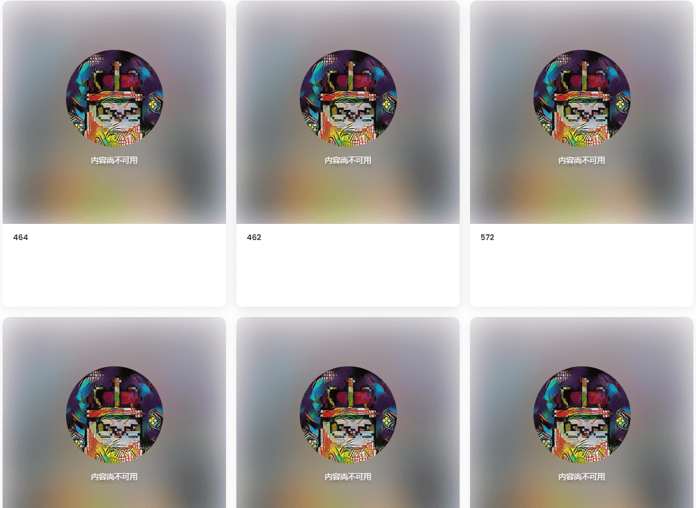

# Picasso Moonbirds AI

Picasso Moonbirds AI是以太坊区块链上的一个数字艺术项目，旨在向毕加索致敬。它们是独特的 1/1 NFT。只有 2000 只毕加索月鸟会被创造出来。该项目的灵感来自 Moonbirds PFP 系列，不隶属于 Proof 团队。

什么是毕加索月鸟 AI？

Picasso Moonbirds AI 是一个 NFT（非同质代币）系列。存储在区块链上的数字艺术品集合。

Picasso Moonbirds AI 代币有多少？

总共有 1,006 个 Picasso Moonbirds AI NFT。目前，337 位车主的钱包中至少有一张 Picasso Moonbirds AI NTF。

最近卖出了多少 Picasso Moonbirds AI？

过去 30 天内售出 0 个 Picasso Moonbirds AI NFT。

