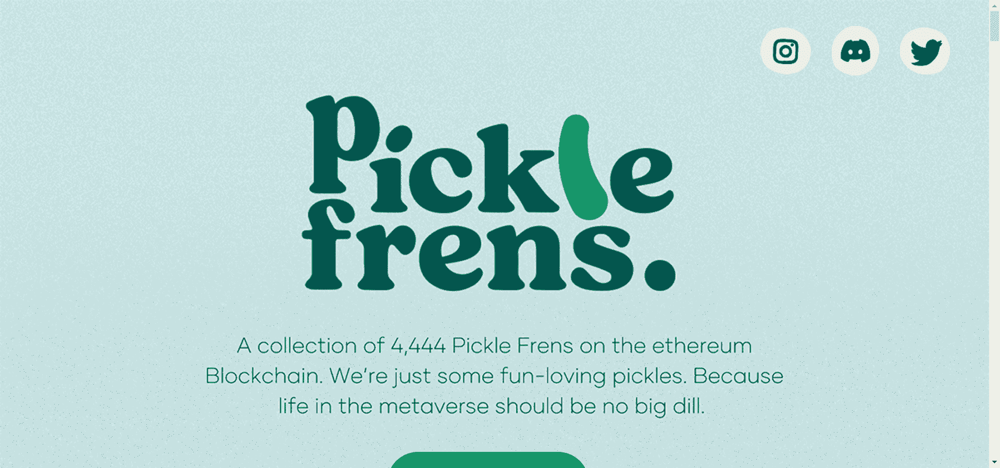

# Official Pickle Frens

以太坊区块链上 4,444 个随机生成和手工腌制的 NFT 集合。我们只是一些有趣的泡菜。因为元宇宙中的生活应该没有什么大不了的。

▶ 什么是官方泡菜？
官方 Pickle Frens 是一个 NFT（非同质代币）集合。存储在区块链上的数字艺术品集合。

▶ 有多少个官方 Pickle Frens 代币？
总共有 4,430 个官方 Pickle Frens NFT。目前，850 位车主的钱包中至少有一份官方 Pickle Frens NTF。

