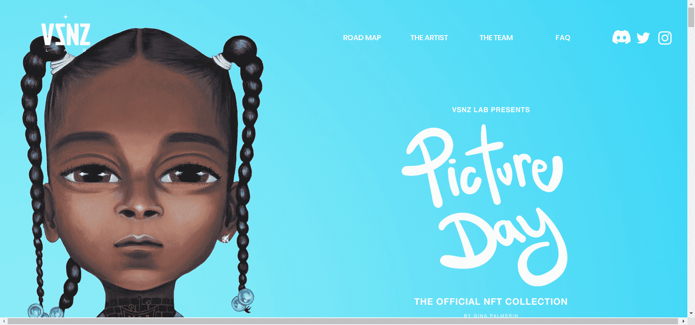

# Picture Day by Gina Palmerin

欢迎来到图片日！Picture Day Collection 由美术师 Gina Palmerin 创建的 5,000 个随机生成的 NFT 组成。该系列的原始图标和特征是在被数字化到虚拟世界之前在木头和帆布上绘制的油画。Gina 的 Genesis 系列的愿景是鼓励和平、爱和自我赋权。代币持有者将可以访问独家 IRL 活动、赠品、空投、商品、未来项目的权利等等。

每个学生的独特性都被 Gina 夫人捕捉和突出，并在木头和帆布上绘制了老式学校风格。吉娜夫人对她的学生的目标是激发和鼓励相信自己和自我赋权。

