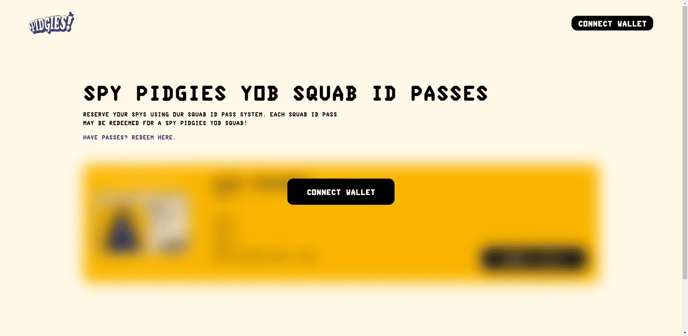

# PIDGIES V2

官方 Spy Pidgies Yob Squab 生成艺术项目。The Squab 的使命是尽可能多地监视人类。我们开发了 Spy Pidgies Yob Squab，在我们的大规模采用计划中也称为 SPYS

什么是 Pidgies：Spy Pidgies Yob Squab？

Pidgies：Spy Pidgies Yob Squab 是一个 NFT（非同质代币）集合。存储在区块链上的数字艺术品集合。

有多少 Pidgies：Spy Pidgies Yob Squab 代币存在？

总共有 8,303 个 Pidgies：Spy Pidgies Yob Squab NFT。目前，1,728 位所有者的钱包中至少有一个 Pidgies：Spy Pidgies Yob Squab NTF。

什么是最昂贵的 Pidgies：Spy Pidgies Yob Squab 特卖？

最昂贵的 Pidgies：Spy Pidgies Yob Squab NFT 出售的是 SPYS #2763。它于 2022-06-18（2 个月前）以 60.4 美元的价格售出。

最近卖了多少 Pidgies：Spy Pidgies Yob Squab？

过去 30 天内售出了 99 个 Pidgies：Spy Pidgies Yob Squab NFT。

Pidgies：Spy Pidgies Yob Squab 多少钱？

在过去 30 天里，最便宜的 Pidgies：Spy Pidgies Yob Squab NFT 销售额低于 10 美元，最高销售额超过 33 美元。Pidgies: Spy Pidgies Yob Squab NFT 在过去 30 天内的中位数价格为 12 美元。

