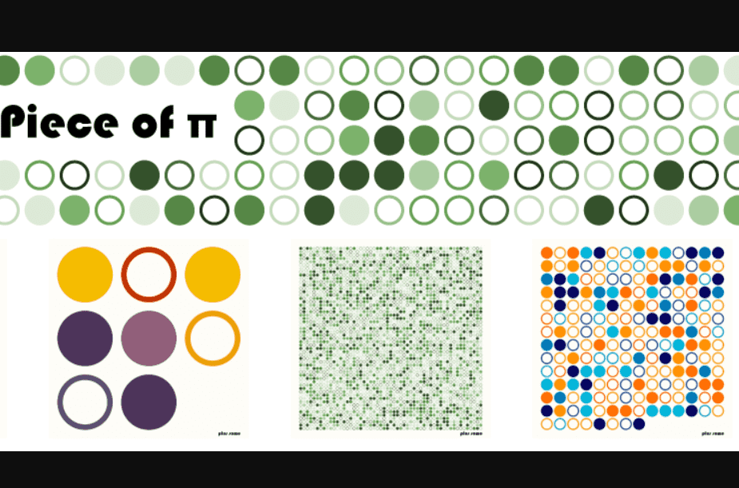

# Piece of 3.141

基于 pi 十进制数字的 3141 件生成艺术品的集合。

▶ 什么是 3.141 的棋子？
3.141 块是 NFT（不可替代令牌）集合。存储在区块链上的数字艺术品集合。

▶ 3.141 代币有多少个 Piece？
总共有 3,141 块 3.141 个 NFT。目前 835 位所有者的钱包中至少有一件 3.141 NTF。

▶ 3.141 拍卖中最贵的一块是什么？
售出的最昂贵的 Piece of 3.141 NFT 是 Piece of π #2265。它于 2022-06-26（2 个月前）以 13.5 美元的价格售出。

▶ 最近卖出了多少件 3.141？
过去 30 天内售出了 11 件 3.141 个 NFT。

