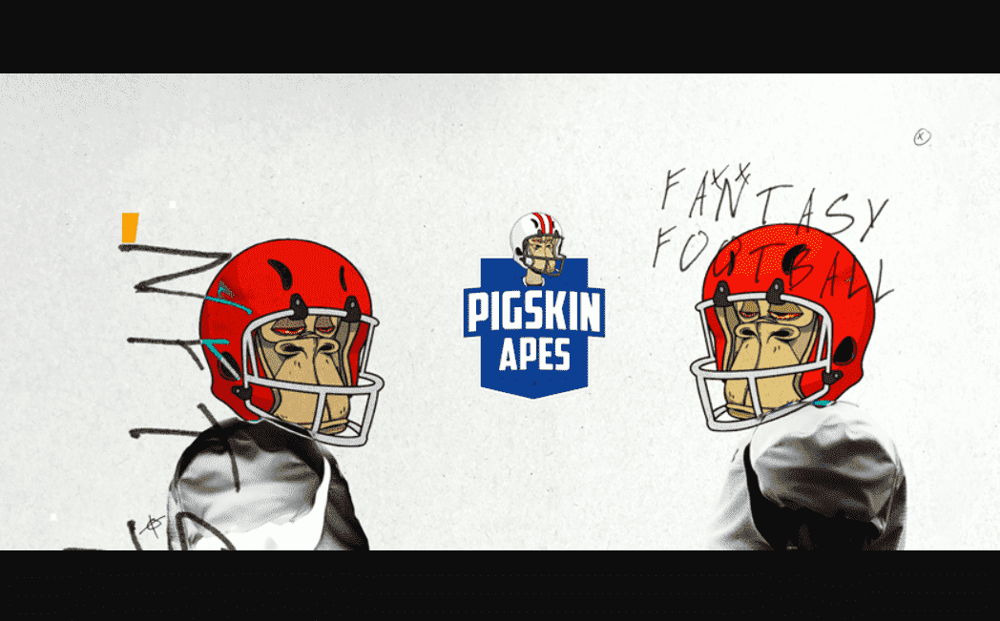

# Pigskin Apes

Pigskin Apes 是一个有趣且令人兴奋的新项目，它将我们世界上的三大挚爱——Apes、Fantasy Football 和 NFTs 结合在一起！Pigskin Apes 是存在于以太坊区块链上的 9600 个独特的数字 ERC-721 代币。

我们推出了 3 套完整的球员——每套由所有 32 支球队编号为 0-99 的球员组成，每套总共有 3200 名球员，总共有 9600 名球员。您的猿不仅是表达对您最喜欢的球队的支持的好方法，它们还可以帮助您在我们的每周和赛季长的奇幻游戏中获得一些相当大的 ETH 奖品！

