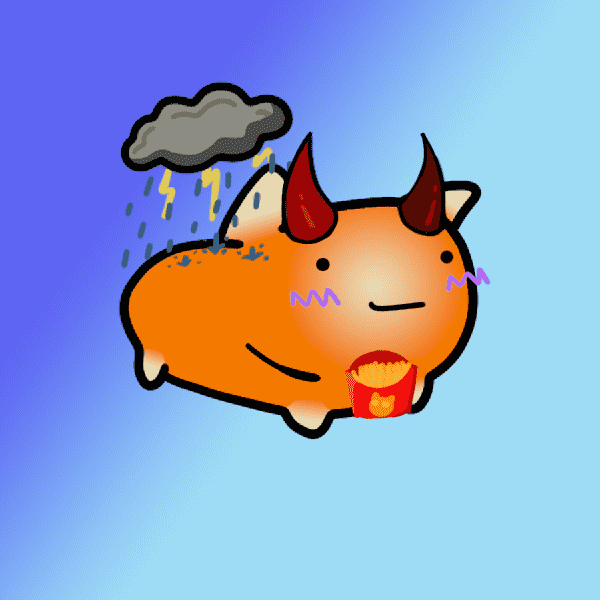

# PillowCats (Eth)

PillowCats 生活在虚拟世界中舒适，它们是由艺术和科学创造的，旨在改善一位年轻探险家的睡眠。

枕猫 （Eth） NFT - 常见问题（FAQ）
▶ 什么是枕猫（Eth）？
PillowCats（Eth）是一个NFT（不可替代令牌）集合。存储在区块链上的数字艺术品的集合。
▶ 有多少个枕猫（Eth）代币存在？
总共有3，306个PillowCats（Eth）NFT.目前有1，183个所有者在他们的钱包中至少有一个PillowCats（Eth）NTF。
▶ 枕头猫（Eth）销售中最昂贵的是什么？
最昂贵的PillowCats（Eth）NFT出售的是PillowCats #1059。它在2022-06-18（3个月前）以$ 5.5的价格出售。
▶ 最近卖了多少只枕猫（Eth）？
在过去的30天内，有4个PillowCats（Eth）NFT售出。
▶ 什么是流行的枕头猫（Eth）替代品？
许多拥有PillowCats（Eth）NFT的用户还拥有My Pet Ghosts，小猴子（ether），Omni Mosquitoes（ETH）和Goji Bears。

