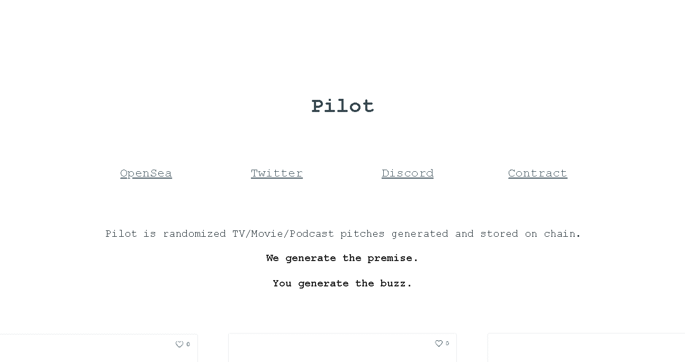

# Pilot Project

Pilot 是随机生成并存储在链上的电视/电影/播客音调。

▶ 什么是 Pilot Project？
Pilot Project 是一个 NFT（Non-fungible token）集合。存储在区块链上的数字艺术品集合。

▶ 有多少 Pilot Project 代币？
总共有 1300 个 Pilot Project NFT。目前 389 位所有者的钱包中至少有一个 Pilot Project NTF。

