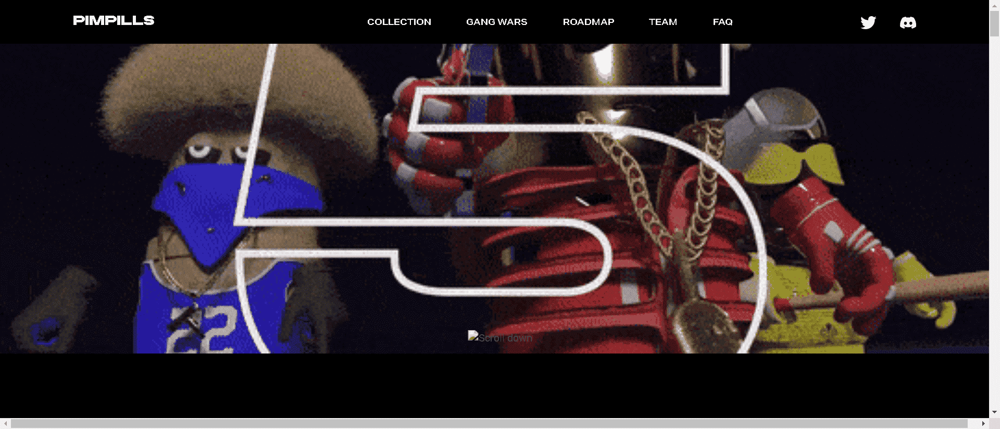

# PIMPILLS GANG

PIMPILLS 是 4440 个独特角色的原始集合，分为五个暴力街头帮派。

▶ 什么是 PIMPILLS GANG？
PIMPILLS GANG 是一个 NFT（非同质代币）集合。存储在区块链上的数字艺术品集合。

▶ PIMPILLS GANG 代币有多少？
总共有 79 个 PIMPILLS GANG NFT。目前，46 位所有者的钱包中至少有一个 PIMPILLS GANG NTF。

▶ 最昂贵的 PIMPILLS GANG 销售是什么？
售出的最昂贵的 PIMPILLS GANG NFT 是 HIDDEN PIMPILL。它于 2022 年 6 月 27 日（2 个月前）以 98.8 美元的价格售出。

