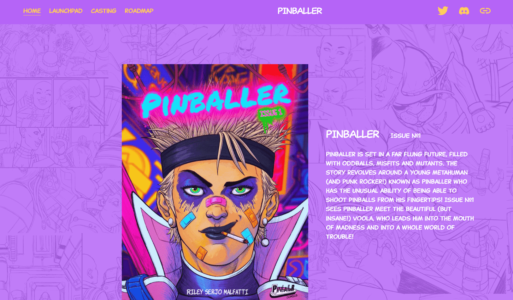

# Pinballer Comics

欢迎来到 Opensea 弹球手之家！

加入 Pinballer 的冒险之旅，因为他遇到了美丽（但疯狂！）的 Voola，他将他带入疯狂之口，并进入

一个充满麻烦的世界！

Pinballer Comics NFT 在过去 7 天内售出 1 次。Pinballer Comics 的总销售额为 27.45 美元。

Pinballer Comics NFT 的平均价格为 27.4 美元。Pinballer Comics 共有 316 位所有者，总共拥有 

728 个代币。

##### ▶ 什么是弹球漫画？

Pinballer Comics 是一个 NFT（不可替代代币）系列。存储在区块链上的数字艺术品集合。

