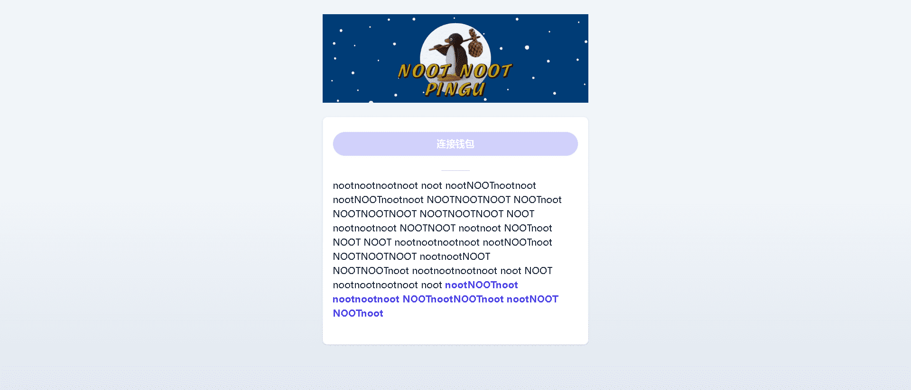

# PinguNootNoot

▶ 什么是 PinguNootNoot？
PinguNootNoot 是一个 NFT（不可替代令牌）集合。存储在区块链上的数字艺术品集合。

▶ 有多少 PinguNootNoot 代币？
总共有 2,000 个 PinguNootNoot NFT。目前，364 位所有者的钱包中至少有一个 PinguNootNoot NTF。

▶ 什么是最昂贵的 PinguNootNoot 销售？
售出的最昂贵的 PinguNootNoot NFT 是 ???nootNOOT??? . 它于 2022 年 6 月 20 日（2 个月前）以 2.2 美元的价格出售。

