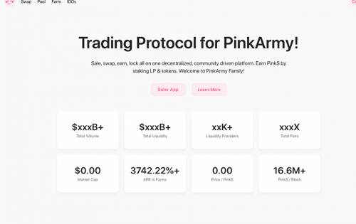
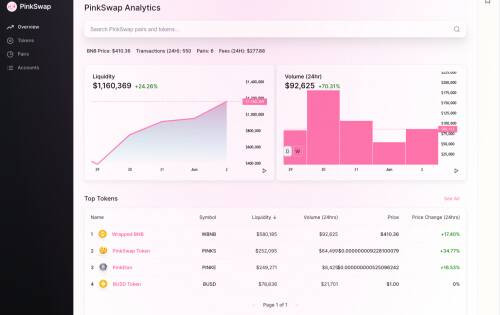

# PinkSwap

PinkSwap 是一个去中心化交易所，用于将 BEP-20 代币换成 PinkArmy。PinkSwap 使用自动做市商 (AMM) 模型。这意味着虽然你可以在平台上交易数字资产，但没有一个订单簿可以让你与其他人匹配。相反，您使用流动资金池进行交易。

在一个去中心化、社区驱动的平台上进行销售、交换、赚取、锁定一切。通过质押LP和代币赚取PinkS。我们为去中心化金融世界构建了一套工具。PinkMoon、PinkSale、PinkElon PinkLock、PinkSwap，

