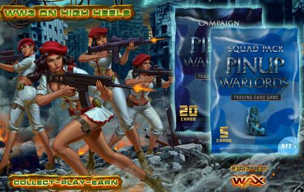
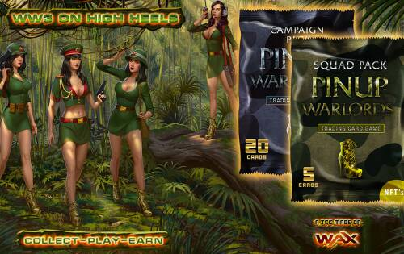
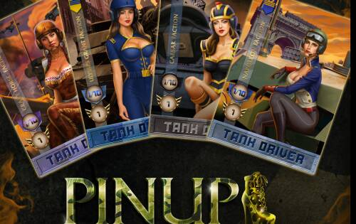

# Pinupwarlords

第三次世界大战……但不是你想的那样。这一次，女人们正在打架……这些小鸡不在乎她们是否会弄断指甲或弄脏化妆品。这些是投下炸弹的重磅炸弹……与狙击步枪保持长期关系的泼妇……宁愿潜入敌方基地也不愿看浪漫喜剧的蛇蝎美人。Pinupwarlords 是一款有趣且快节奏的游戏，可完全在链上赚取 NFT 集换式卡牌游戏，具有令人惊叹的 ART 和多 PvP 模式。这是一款玩家拥有资产并可以自由转售并参与其生态系统的游戏。

这是一款纯 PVP 卡牌游戏，玩家使用他们的卡牌组进行比赛

主卡由 NFT 组成，您将能够使用 FT“启动”以增强角色的能力。巧妙地使用各种组合将增加您获胜的机会

每个派系都是限量版，将来自总共12个班级，全部手绘

您拥有的派系越完整，您将达到更高的“收藏家级别”，从而增加您的整体被动收入

每个 NFT 都有自己的战斗经验登录到区块链上，在每次战斗后独立于其所有者增长

系列 1 NFT 的主题是“大将军”

