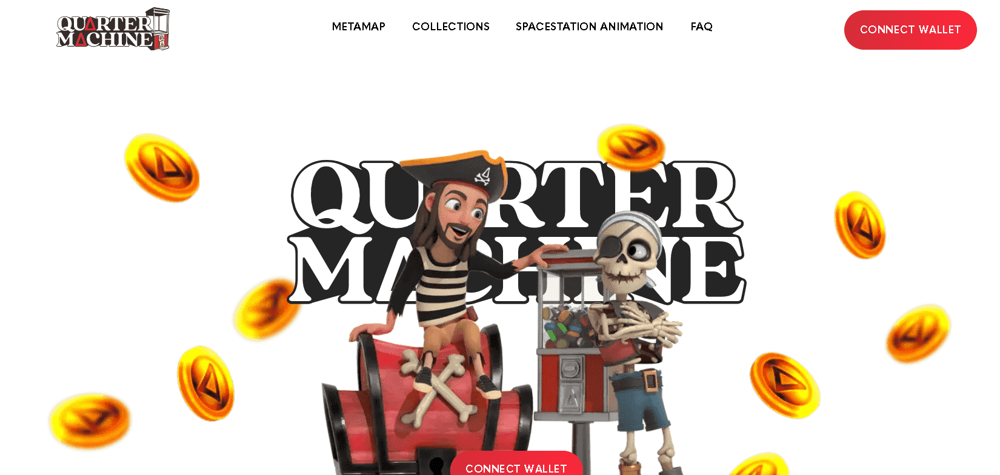

# Quarter Machine PiRATE iSLAND

GENESiS 集合了 1,000 件独特的 3D 艺术作品，这些 NFT 源自 Spacestation Animation 首个剧集“PiRATE iSLAND”中的对象、角色、道具和场景。这个项目已经开发了一年多，所有的艺术作品都经过装配、动画处理，并具有独特的材料、纹理和着色器。

当你的 NFT 成为焦点时赚取。Spacestation Animation 在我们的每个 YouTube 剧集中随机展示我们 NFT 收藏中的资产。当您的 NFT 成为焦点时，您将获得奖励！

