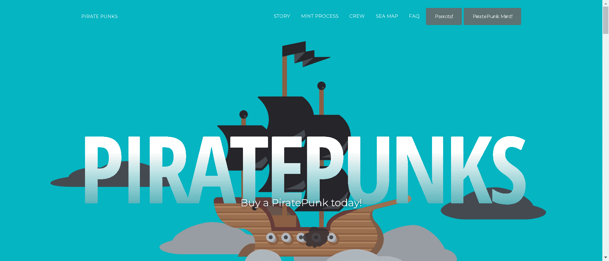

# PiratePunksNFT

在深蓝色的海洋中，有 6,969 名流浪海盗正在寻找新的船长。你准备好驾驭这艘船穿越狂暴的风暴、激烈的战斗以及充满掠夺和掠夺的旅程吗？

8 月 21 日，世界标准时间凌晨 1 点，海盗朋克队奋力冲向 OpenSea。全部6,969 3,952Pirate Punks 由我们的网站铸造而成，并以每个 0.02 ETH 的固定价格分发。

对于我们忠实的船长，我们将直接向获奖者的钱包赠送各种奖品，包括更多独家 NFT 配件和 ETH。参与者需要完成我们的特殊宝藏任务才能获得资格。我们还将从我们的社区基金中捐赠给选定的慈善机构。

