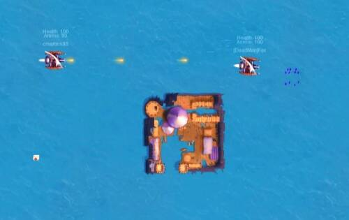
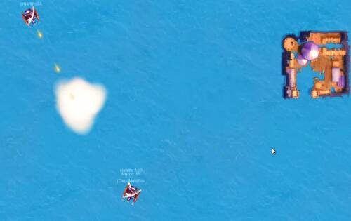
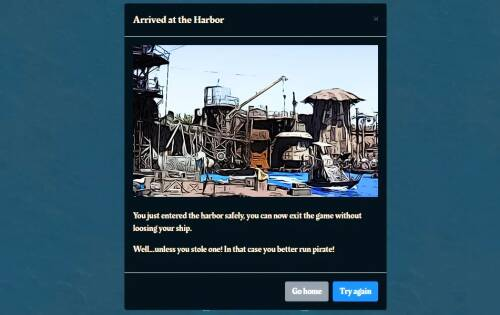

# Pirates 2048

Pirates 2048 是一款基于浏览器的多人未来海盗船对战游戏，具有动作和策略元素。每个玩家控制一艘海盗船，并旨在在海上竞技场中生存，其他海盗试图摧毁船只并从海上收集珍贵物品以赚取积分和加密货币。

每年年底都会举办一场盛大的锦标赛。要获得资格，您需要在排行榜上名列前茅，赢得资格赛或获得特别门票

2048...我们的星球是一个非常不同的地方。20 年代和 30 年代气候变化加剧，导致地球上所有的陆地冰在 2035 年融化。这极大地重塑了大陆并淹没了世界上许多主要城市。

然后是 2039 年和不明原因的核大屠杀。现在剩下的大部分土地都是核荒地，大多数幸存者住在小岛或被称为港口的浮动社区。大部分技术和知识都丢失了。

海洋现在是一个危险的地方，到处都是海盗和他们的部落。2048年，来历不明的神秘紫石开始出现在海洋中。

作为最受尊敬的社区领袖之一，布特林勋爵了解他们的力量……

他向海港周围的海盗发起了挑战：一场海上竞技场的盛大比赛，找出谁是最伟大的石头收藏家！

