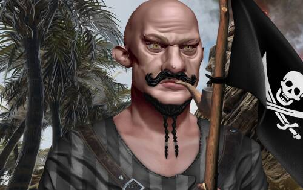
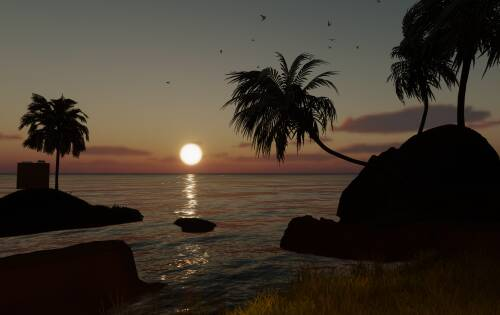
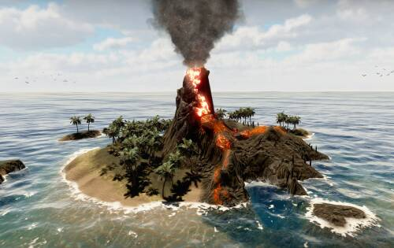

# Pirates of the Arrland

Pirates of the Arrland 是第一个包含 10,000 个海盗角色的集合，它是为即将推出的 3D 高质量游戏而创建的，具有 Play to Earn 的概念。拥有多个海盗意味着您可以寻找最稀有和独特的特质，因为它们将对游戏产生真正的影响。Pirates 将有能力生成实用程序 $RUM 代币，该代币稍后将用于培养年轻的 Pirates、制作物品、升级能力等。

Pirates of Arrland 是世界上第一款将多人在线战斗竞技场 (MOBA) 竞争与经济和战略游戏相结合的游戏。它设置在海盗世界中，它的另一个优势是可以创造玩家周围的空间。

该项目具有深刻的游戏玩法和优质的图形，并且由于区块链技术，它允许玩家拥有在游戏中获得的角色、物品、船只和土地。通过这种方式，玩家参与了 Arrland 的元宇宙海盗的不断发展。

不同喜好的玩家可以相遇、结盟、互相影响、交易。可交易物品的价值由生态系统的共同规则决定，价格由供需调节。

多种玩法，在基于Unity 2021 HDRP引擎的生态环境中为玩家提供大量乐趣，解决现阶段加密游戏行业缺乏玩家的问题发展。此外，游戏中存在的许多功能都是针对传统玩家的，这将成倍增加规模效应。

The Pirates of the Arrland 游戏是一款设置在 Pirates of the Arrland 的作者世界中的 3D 游戏。

在游戏过程中，玩家将任务分配给他的下属，或者扮演一个选定的角色并控制他们作为他们的化身。这使他们能够在 Arrland 的奇妙世界中漫游，发展和丰富他们的英雄以及分配给给定钱包地址的金库。重要的是，游戏中所有最基本的元素
，例如海盗、船只、土地和物品，都是位于玩家钱包中的 NFT 代币。因此，玩家拥有对它们的全部权利，可以将它们出售或借给其他玩家。

根据所选的游戏类型，Arrland 的世界通过不同类型的相机呈现。玩家可以从第一人称视角 (FPP)、第三人称视角 (TPP)、从上方（俯视图）或使用免费相机观察环境。

通过位于家乡岛上的魔法门户过渡到战场。玩家可以设置新游戏或加入现有游戏。与其他玩家的竞争可以在不同大小的地图上进行——确定游戏所需的最小和最大玩家数量。地图的地形以及环境的互动元素各不相同，极大地影响了游戏的进程。

