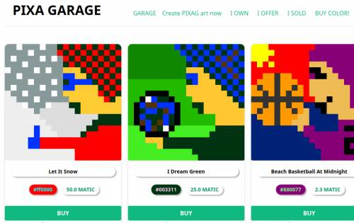
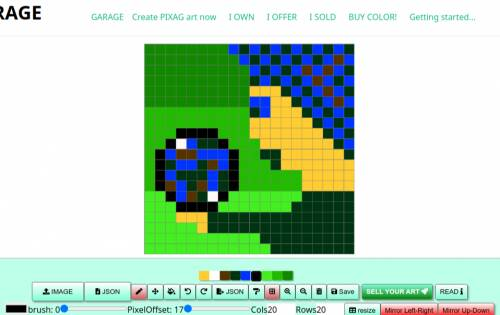
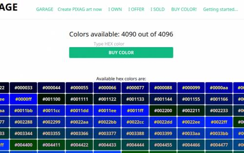

# Pixa Garage

Polygon 网络上的 NFT Marketplace 和 NFT 像素艺术创作工具

您可以使用我们的 pixa 车库像素艺术绘图工具创建任意数量的 NFT 像素艺术项目

您可以为您的物品定价，直接在 pixagarage.com 上出售，或在 OpenSea 或任何支持 Polygon 的 NFT 市场上列出。

此外，您可以在我们的市场上铸造/拥有十六进制颜色。铸币价格为 5 Matic，拥有一种颜色，当出售的商品包含您的颜色作为主导时，您将获得 pixagarage.com 上任何销售的 10%。

主色是像素艺术中最常用的一种，由 pixagarage 在线工具创建。

有 4096 种颜色可供选择，一个地址最多可以拥有 16 种不同的颜色。

Pixa Garage 的梦想是有朝一日帮助小型企业从零开始，从像素到形状。

我们希望我们的作品基于几个共同的特征，例如：友谊、爱情、新春、幸福、孩子、善良、欢笑、欢乐、乐趣、创造力、音乐、美丽、自然等等……

我们希望用我们认为在当前世界中缺少的所有这些重要价值观来为新的现实世界着色。

我们想要强调所有这些，我们梦想着一个新社区从我们简单的像素艺术作品中诞生的世界，然后，随着时间的推移，它们会变得更大，不仅仅是一个初始图像，尽管如此，永远是那个新想法的品牌

