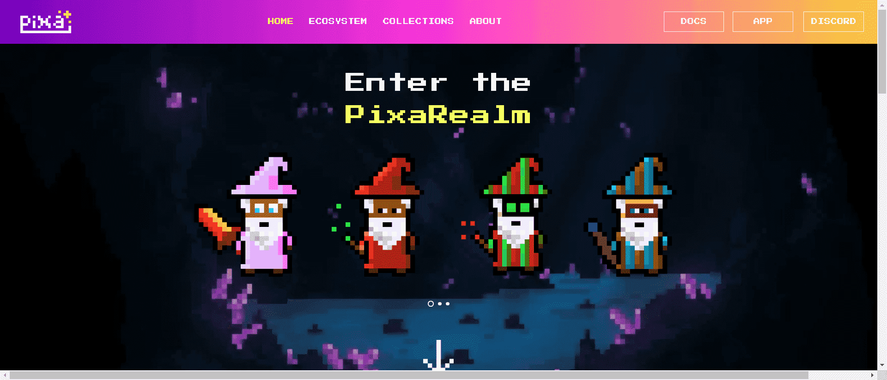

# PixaLE

- 推出“生物”系列
- 仅为 PixaWizard 所有者创建街机游戏
- 创建元节俱乐部（PixaWizard Pub 和 PixaWitch Tavern in cryptovoxels）

创建我们自己的 erc20 实用代币：$PIXA

创建 WizarDAO 并附带 DAO NFT（由著名的 3D 艺术家 Tim Riopelle 设计）

为 $PIXA 的公平分配创建奖励系统

3D 虚拟世界 - PixaRealm - 演示

许多项目将在 2022 年完成，包括通过以太坊和 Arweave 上的存储将所有收藏品链上链，对 PixaRealm 元节进行季度更新，以及其他一些惊喜！

