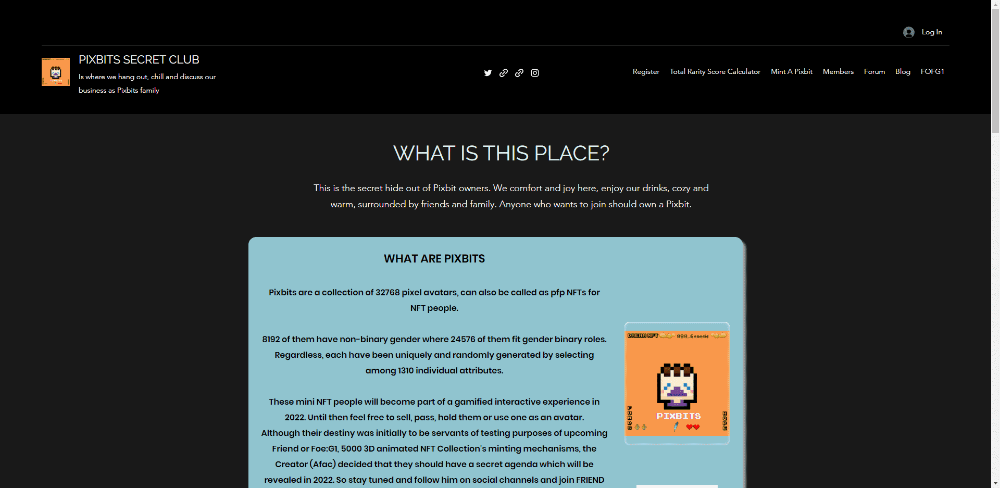

# Pixbits

Pixbits 是 32768 像素头像的集合，也可以称为 NFT 人的 pfp NFT。

其中 8192 个具有非二元性别，其中 24576 个符合性别二元角色。无论如何，每一个都是通过在 1310 个单独的属性中进行选择而唯一且随机地生成的。

这些迷你 NFT 人将在 2022 年成为游戏化互动体验的一部分。在此之前，您可以随意出售、传递、持有他们或将他们用作头像。

尽管他们的命运最初是为即将到来的 Friend or Foe:G1 的测试目的服务，5000 个 3D 动画 NFT 合集的铸币机制，但 Creator (Afac) 决定他们应该有一个秘密议程，该议程将于 2022 年公布。敬请期待并在社交渠道上关注他并加入不和谐的朋友或敌人社区。

只是奖励阅读所有描述的人直到这一点的线索：这个项目的灵感来自 Pak 的 LostPoets 以及 Afac 在高中时在学生中流行的游戏。

