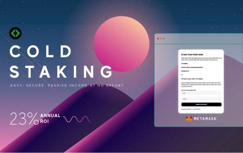

# PIXBY

PIXBY 智能合约使用了加密货币质押的概念，可以描述为对固定在您的银行账户中的一定数额的资金持有利息。在这种情况下，代币被锁定在智能合约中一段时间，以获得每日奖励作为回报。有效质押收益 质押奖励计算为年度投资回报率的 23%。例如，如果您在 365 天内质押 2,000,000 PIXBY 代币，您将能够每天获得 1260.273 PIXBY。

PIXBY 是一种具有独特能力的代币，在其他任何地方都没有。用户可以通过每次质押最少 35,000 和最多 2,500,000 PIXBY 来获得被动收入。用户可以完全控制自己的资金和质押期限，不受活跃质押数量的限制。很快，由于 Escrow 协议，利益相关者也将受益于利润分享。

除了作为一个社区驱动的激励项目外，我们的目标之一是创建易于使用的开源工具，为全球数十个新的自由职业市场提供动力。加拿大游戏俱乐部的开发者已经在使用这个工具

