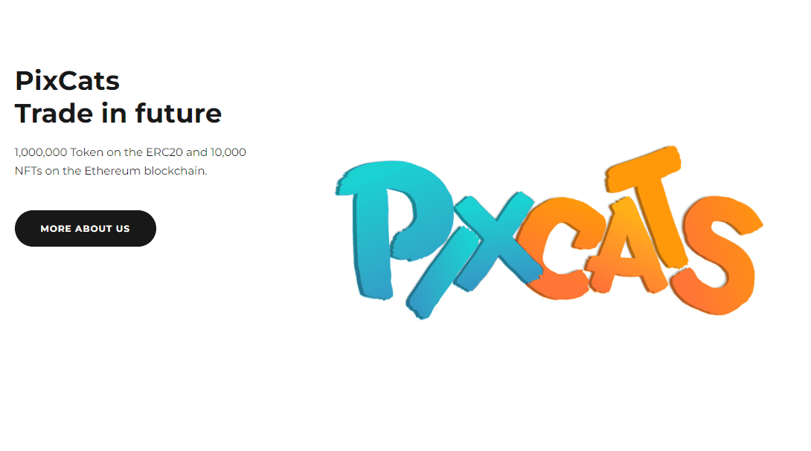

# PixCats NFT

我们由几位经验丰富的加密货币人员和 NFT 创建者组成。

我们是富有创造力的技术专家，曾参与过加密和 NFT 领域的多个项目。我们为爱好者介绍 Token 和 NFT 项目。该项目将在未来继续与强大的社区一起开发，以避免硬币和 NFT 交易造成的损失。我们设定了几个目标，以提高项目的价格和可及性。我们希望与社区一起帮助代币和 NFT 交易的新手。该令牌是为初学者制作的，以避免加密空间中的欺诈行为。我们希望为您提供最好的。

对于初学者，我们为初学者制作了便宜的 NFT。我们希望他们能够了解 NFT 空间中的交易，并了解有关它的各种信息。这将是他们、我们和社区的热情所在。

我们为大众制作了 10,000 个 NFT 艺术作品。这些代币是为交易而创建的，可以为我们创造的 NFT 艺术增加价值。

