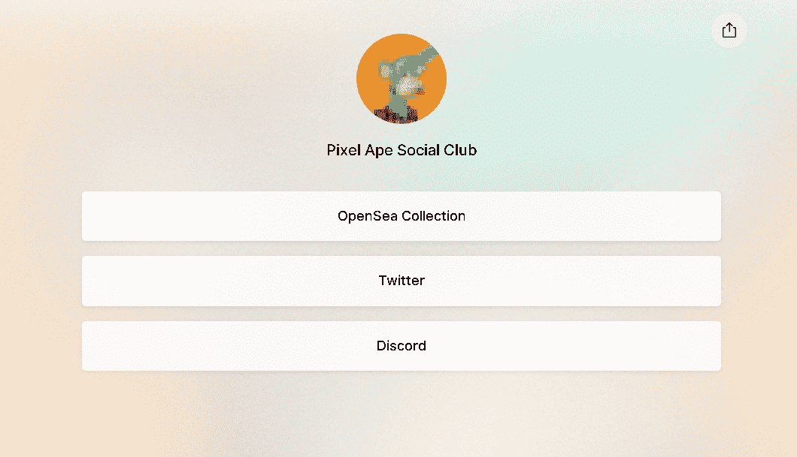

# Pixel Ape Social Club

PASC是1000像素猿的集合！每只猿都是独一无二的，尽管有些特征比其他特征更独特！找到你的猿加入社交俱乐部。干杯!

▶ 什么是像素猿社交俱乐部？
Pixel Ape Social Club 是一个 NFT（Non-fungible token）集合。存储在区块链上的数字艺术品集合。

▶ Pixel Ape Social Club 代币有多少？
总共有 1,000 个 Pixel Ape Social Club NFT。目前，74 位车主的钱包中至少有一个 Pixel Ape Social Club NTF。

