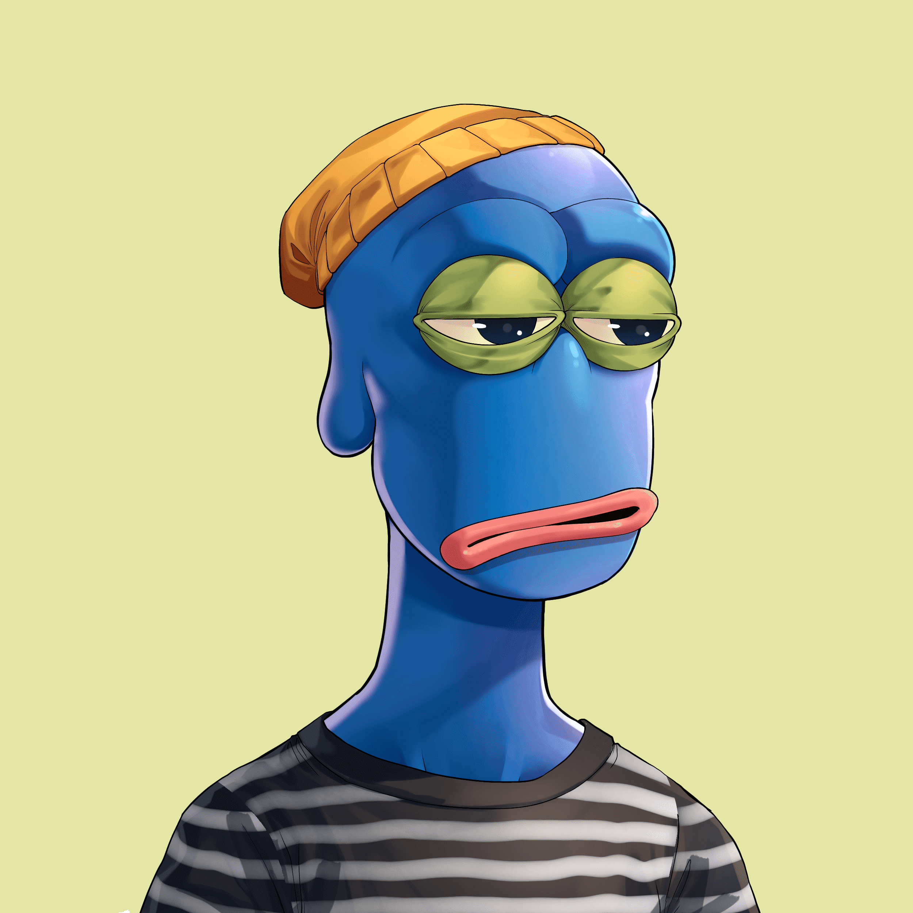

# Pixel Apepe YC

Rare Apepes 是对 NFT 文化中最具标志性的两部作品的致敬：@BoredApeYC 和#RarePepes（非附属）。 由@rare_labs 设计。 这是 NFT、Meme 和文化的交集。

作为最具历史意义的收藏品之一，Rare Pepe's早在2016年就将模因能量带入了区块链。2015年，Pepe模因的一个子集开始被称为“稀有Pepes”，带有诸如“RARE PEPE DO NOT SAVE”之类的水印，通常意味着艺术家以前没有公开发布过模因。2015年4月，一系列稀有的Pepes在eBay上列出，价格达到99，166美元，然后从网站上删除。

2016年9月，第一批罕见的Pepes在比特币上428919区块中开采，比流行的基于以太坊的NFT（包括CryptoPunks）早了一年多。不久之后，一个致力于讨论交易对手NFT的电报聊天组被创建。到2017年，一个围绕数字收藏品的社区已经发展壮大，促使开发人员建立平台，以便对这些独特的图像进行编目和交换，从而在2016年创建了第一个加密艺术市场。

2018年1月13日，纽约市举行了一场罕见的Pepes的现场拍卖，其中包括一场以荷马·辛普森（Homer Simpson）为原型的拍卖会，售价为38，500美元，观众席上观看了大都会艺术博物馆，现代艺术博物馆和苏富比艺术学院的代表观看了此次拍卖会。三年后，买家以312，000美元的价格出售了它。

该项目的历史意义不容小觑。

