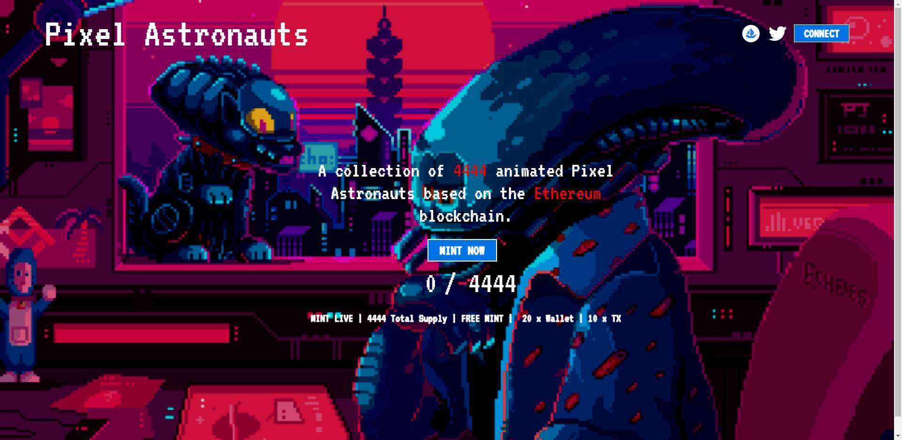

# PxAstronauts

在我的 NFT 中，我会创造宇航员，因为我喜欢天文学。如果有人喜欢宇航员或天文学，这是给你们的。希望大家喜欢我的作品

什么是 Astronauts_for_2D_NFTS？

Astronauts_for_2D_NFTS 是一个 NFT（不可替代代币）集合。存储在区块链上的数字艺术品集合。

有多少 Astronauts_for_2D_NFTS 代币？

总共有 29 个 Astronauts_for_2D_NFTS NFT。目前，40 位所有者的钱包中至少有一个 Astronauts_for_2D_NFTS NTF。

最近卖出了多少 Astronauts_for_2D_NFTS？

过去 30 天内售出了 0 个 Astronauts_for_2D_NFTS NFT。

