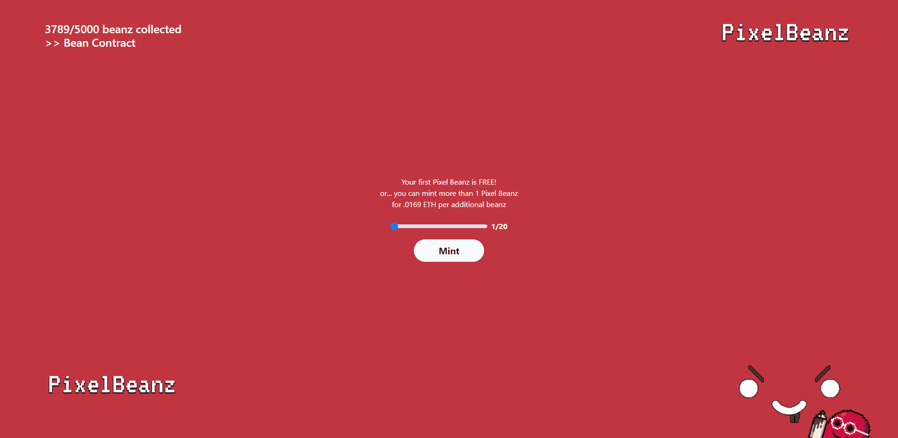

# Pixel Beanz V3

您的第一个 Pixel Beanz 是免费的！ 或者...您可以以每增加 0.0169 ETH 的价格
铸造超过 1 个 Pixel Beanz

免费薄荷！Pixel Beanz 是 Pixel Beanz 的免费退化集合，由以太坊区块链上的史诗游戏玩家制作。

每个钱包 1 个免费薄荷糖，每个额外的 beanz 0.0169！

什么是 Pixel Beanz V3？

Pixel Beanz V3 是一个 NFT（Non-fungible token）集合。存储在区块链上的数字艺术品集合。

有多少个 Pixel Beanz V3 代币？

总共有 3,789 个 Pixel Beanz V3 NFT。目前，702 位所有者的钱包中至少有一个 Pixel Beanz V3 NTF。

Pixel Beanz V3 最近卖出了多少？

过去 30 天内售出 0 个 Pixel Beanz V3 NFT。

