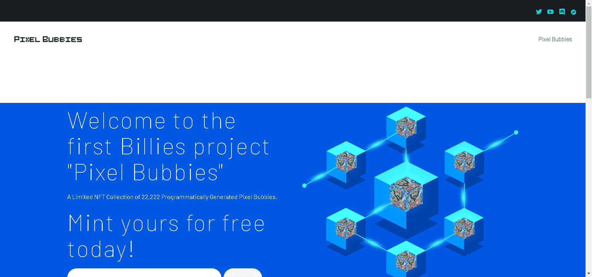

# Pixel Bubbies

Pixel Bubbies 是 Billie's 送给 NFT 和加密艺术社区的礼物。总共 22,222 个

▶ 什么是像素泡泡？
Pixel Bubbies 是一个 NFT（不可替代令牌）集合。存储在区块链上的数字艺术品集合。

▶ 有多少个 Pixel Bubbies 代币？
总共有 17,558 个 Pixel Bubbies NFT。目前，739 位所有者的钱包中至少有一个 Pixel Bubbies NTF。

▶ 什么是流行的 Pixel Bubbies 替代品？
许多拥有 Pixel Bubbies NFT 的用户还 通过 Gray Scaling、 HOOKS Alpha Pass、 Okay Space Bears和 weape24拥有 Celestial Bodies 。

