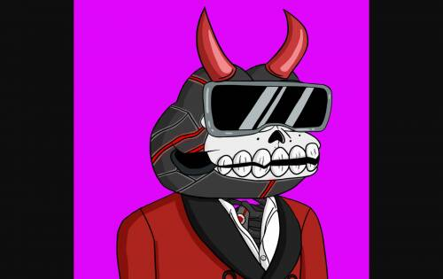
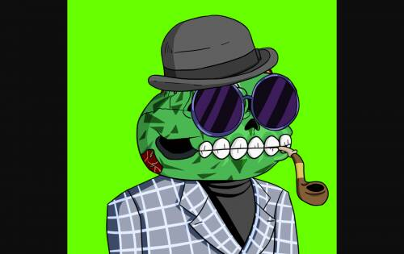
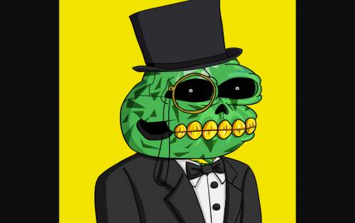

# Pixel Degen Gang

7,000 个独特的 DEGEN GANG 成员 NFT 是由 180 多个特征的随机组合以编程方式生成的。DEGEN GANG 成员 NFT 以 ERC-721 代币的形式存在于以太坊区块链上。

BAR FIGHTS 是首创的 P2E 格斗游戏，您可以在其中使用 NFT 与他人战斗并赚取金币。

德根帮VS无聊猿？Bar Fights 将与其他 PFP 项目整合，以决定谁是酒吧中最难对付的人！

