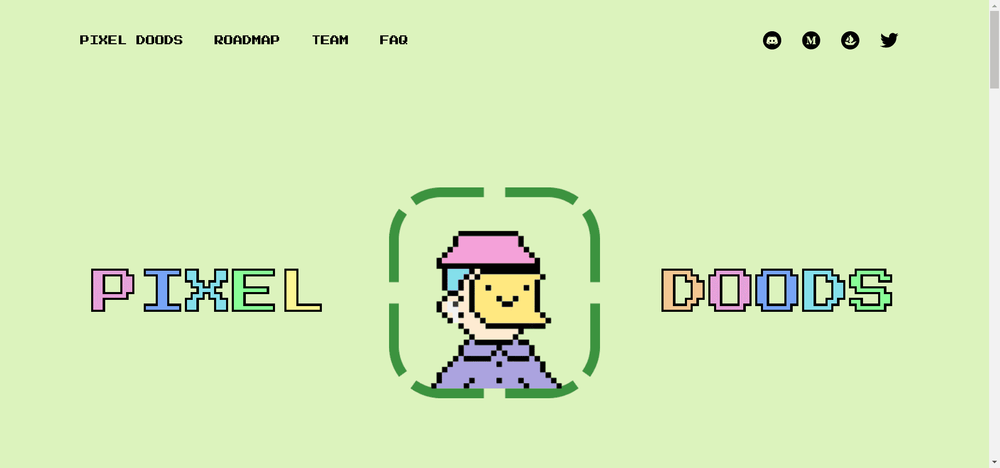

# Pixel Doods NFT

Pixel Doods 是一个由 8,888 个数字绘制和随机生成的 NFT 组成的项目，这些 NFT 存在于以太坊区块链上。

Pixel Doods 是 Pixels in Space 宇宙的一部分。通过持有 Pixel Dood，您可以积极参与我们的 Idle RPG（角色扮演游戏）以获得游戏内的代币奖励和 NFT 奖品。

通过持有 Pixel Dood，您可以访问我们的原创游戏 Pixels in Space™。这将是一款冒险 RPG，您可以在其中发送您的 Pixel Dood 执行任务以获得奖励。

