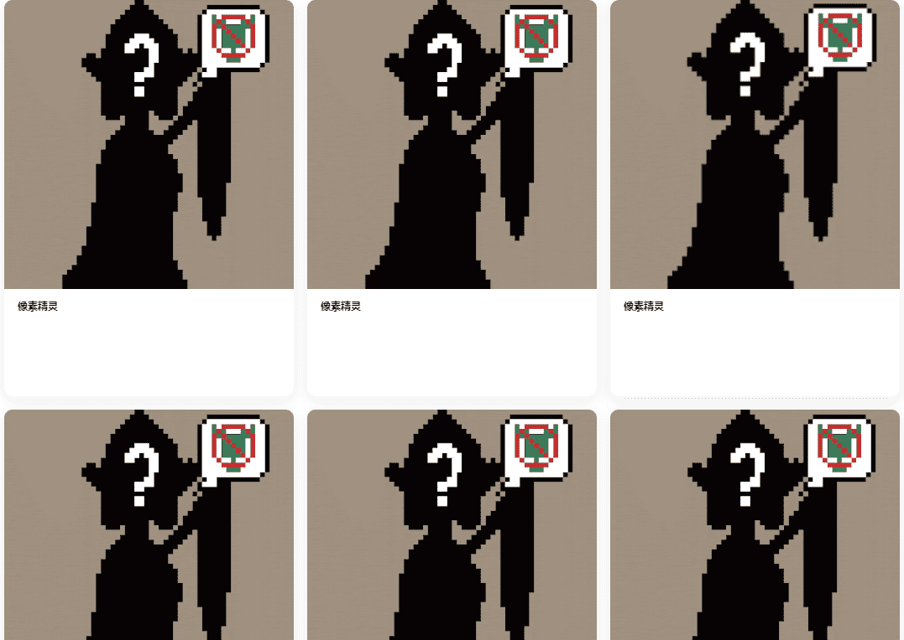

# PixelElfs

对于那些错过的人... 像素精灵 ATTACK DA GOBLINSSSSSSSSSSSS

什么是 PixelElfs？
PixelElfs 是一个 NFT（Non-fungible token）集合。存储在区块链上的数字艺术品集合。
有多少个 PixelElfs 代币？
总共有 5,529 个 PixelElfs NFT。目前，578 位所有者的钱包中至少有一个 PixelElfs NTF。
最近卖出了多少个 PixelElf？
过去 30 天内售出 0 个 PixelElfs NFT。
什么是流行的 PixelElfs 替代品？
许多拥有 PixelElfs NFT 的用户也拥有 Artifical Mind | AI、 BloodyApeFromHell、 角色设计官方和 LilBabyMews。

