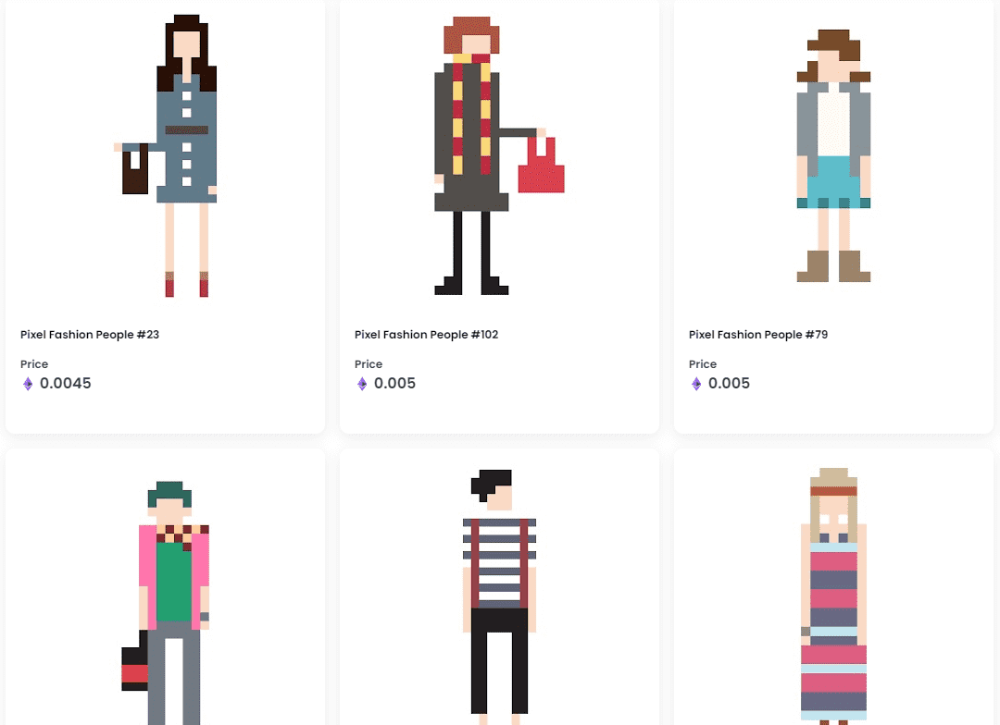

# Pixel Fashion People

一组 240 位像素化的建模男女，所有这些 NFT 都是单独绘制的，其中没有副本

什么是像素时尚人物？

Pixel Fashion People 是一个 NFT（不可替代代币）系列。存储在区块链上的数字艺术品集合。

Pixel Fashion People 代币有多少？

总共有 240 个 Pixel Fashion People NFT。目前 5 位所有者的钱包中至少有一个 Pixel Fashion People NTF。

Pixel Fashion People 最近卖出了多少？

过去 30 天内售出了 0 个 Pixel Fashion People NFT。

