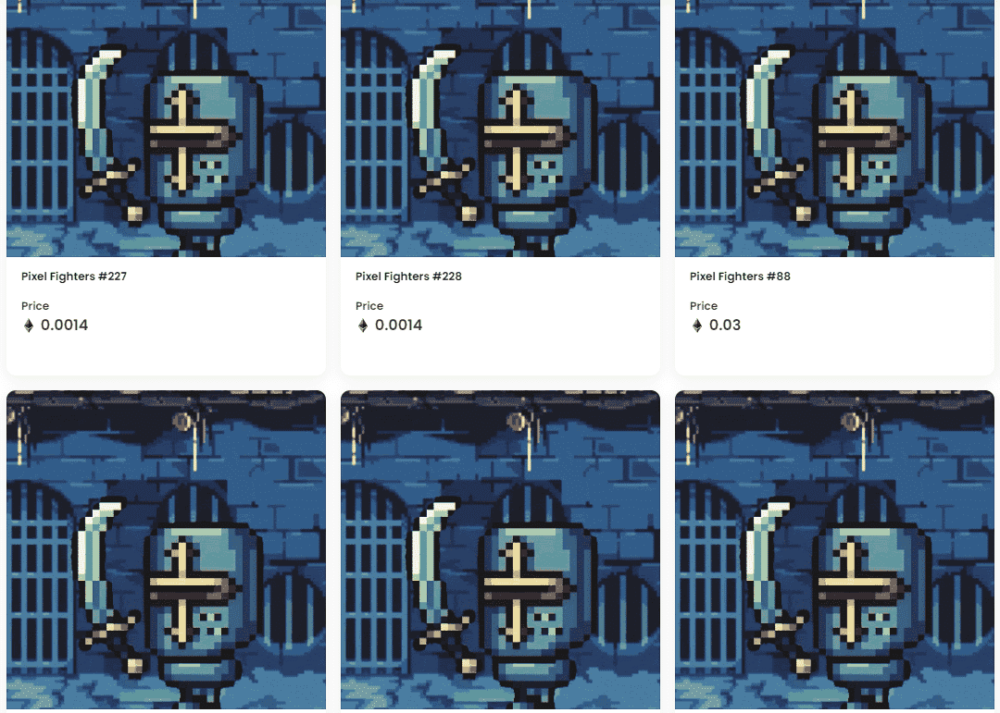

# Pixel Fighters NFT

Pixel Fighters 是以太坊区块链上 1,111 个随机生成的 Pixel Fighters NFT 的集合。人类601人，精灵256人，兽人256人。他们勇敢、雄心勃勃、坚强，随时准备为自己的领土而战。

你有勇气加入战斗吗？前 600 个免费，然后每个战士 0.005 个。-在我们的正式合同上铸币！

什么是 Pixel Fighters NFT？

Pixel Fighters NFT 是一个 NFT（不可替代令牌）集合。存储在区块链上的数字艺术品集合。

Pixel Fighters NFT 代币有多少？

总共有 648 个 Pixel Fighters NFT NFT。目前，335 位所有者的钱包中至少有一个 Pixel Fighters NFT NTF。

Pixel Fighters NFT 最昂贵的交易是什么？

出售的最昂贵的 Pixel Fighters NFT NFT 是 Pixel Fighters #102。它于 2022-07-01（2 个月前）以 2.7 美元的价格售出。

Pixel Fighters NFT 最近卖出了多少？

过去 30 天内共售出 7 个 Pixel Fighters NFT NFT。

