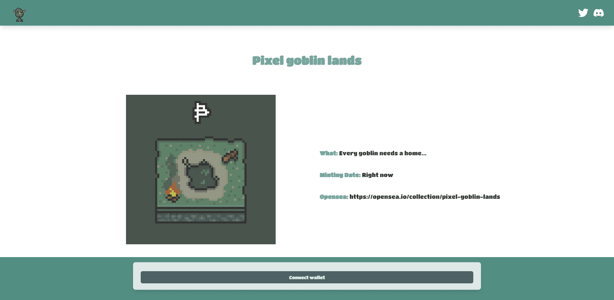

# Pixel goblin lands

什么是像素地精？
Pixel goblin lands 是一个 NFT（非同质代币）集合。存储在区块链上的数字艺术品集合。
像素地精土地代币有多少？
总共有 2,126 个像素地精土地 NFT。目前，448 位所有者的钱包中至少有一个 Pixel goblin Land NTF。
最昂贵的像素地精土地销售是什么？
NFT 出售的最昂贵的 Pixel goblin lands 是 Pixel goblin lands #248。它于 2022-06-07（3 个月前）以 45.3 美元的价格售出。
最近卖出了多少像素地精？
过去 30 天内售出了 28 个 Pixel goblin lands NFT。
像素地精的土地要多少钱？
过去 30 天，最便宜的 Pixel goblin Land NFT 销售额低于 3 美元，最高销售额超过 18 美元。过去 30 天，Pixel goblin 登陆 NFT 的中位价格为 5 美元。
什么是流行的像素地精土地替代品？
许多拥有 Pixel goblin Land NFT 的用户还拥有 Goblin Land NFT、 Pixel Kevin NFT、 Pixel Doods NFT和 PiecesOfWhat。
 交互式 NFT 项目：Goofball Gang。立即购买。 

