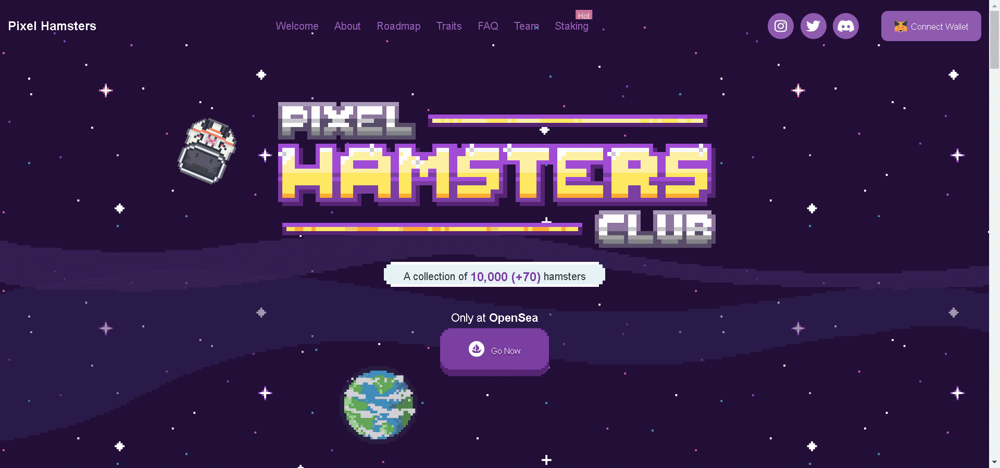

# Pixel Hamsters Club

在一次跨维度科学实验中，来自仓鼠丹宇宙的一大群仓鼠陷入了一个不寻常的像素诗中。在多次尝试返回家园失败后，他们神秘地变成了自己的复古数字版本。

Pixel Hamsters是一个被困在MATIC 网络(ERC-721) 上的集合，由 10,000 个（+ 70 个创世纪）看起来很糟糕的生物组成，等待被收养，并希望有一天能回到他们的宇宙。

当前最小值 任何仓鼠 0,003 ETH 接受的报价。分钟。所有仓鼠接受的报价将继续每售出 2K增加0,001 ETH

