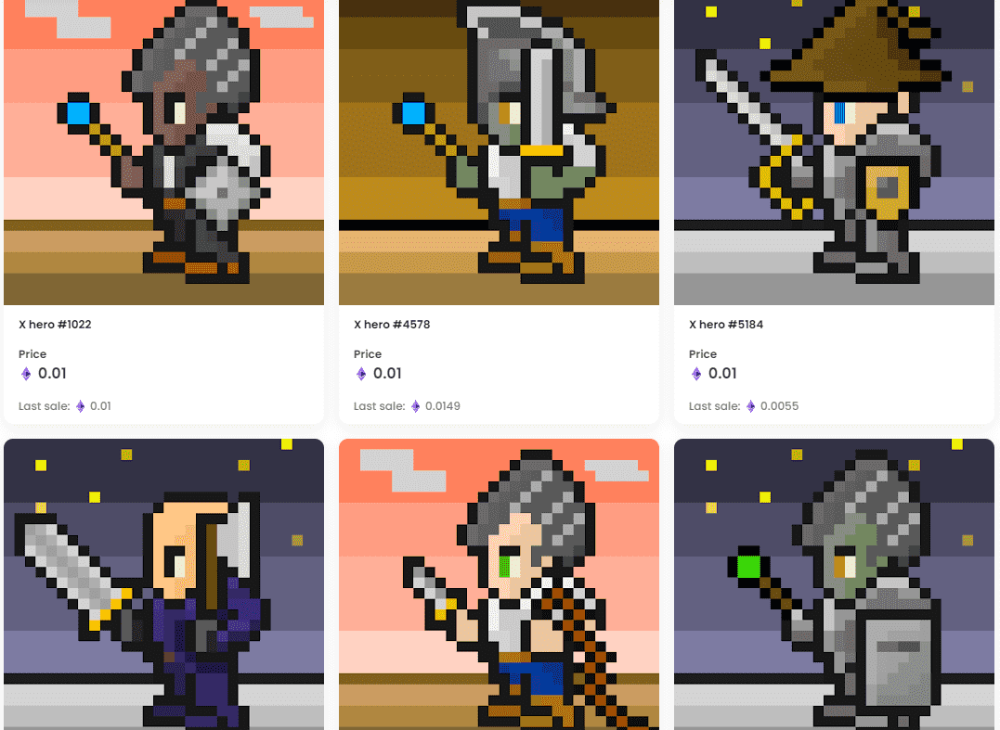

# Pixel Heroes X

Pixel Heroes 是日本第一个生成艺术项目，NFT 是用自己的合约创建的，元数据存储在 IPFS 中，NFT 是治理投票。所有运营权归 DAO 所有，任何拥有它的人都是 DAO 的成员。

Pixel Heroes 是 5,555 个独特的 Pixel Heroes NFT 的集合

每个月我们都会举办一场像素艺术比赛。

获胜者将从管理层获得 10 个 Pixel Heroes X。

该措施将与上述空投有所区别，我们计划确定时间等。

参加本次活动的条件等细节将在比赛举行时公布。

以下是将在空投和像素艺术比赛中分发的 NFT 图像。

Pixel Heroes 的角色决定了他们在 Discord 上的活跃程度。因此，我们会定期召开会议，回答超级英雄及以上的意见。

具体来说，每两周一次，这将是一个一小时的文本会话。

