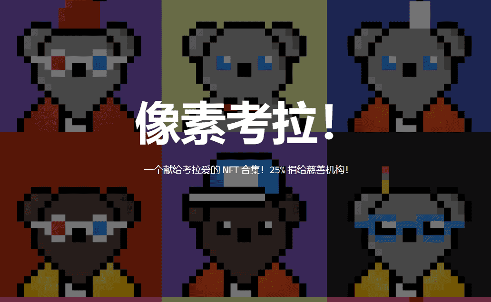

# Pixel Koalas!

这个项目是由考拉爱好者为考拉爱好者创建的。这就是为什么 25% 的利润将捐赠给考拉保护区和慈善机构，让全球考拉受益。

将包含 1000 只考拉。这些 Gen 0 考拉中的 250 只将是免费的。每个重置将铸造 3 MATIC。 25% 的铸币厂收益将捐赠给我们选择的考拉保护区。 
staking 的发展将结束，铸币厂的部分利润将用于为代币 $EUCALYPTUS 提供流动性。 
更多赠品

DAO 也在开发中。DAO 将赋予利益相关者决定资金如何处理的权利。 

更进一步，第二代考拉将被释放。5000 只 Gen 1 Koalas 将以每只 0.5 MATIC 的价格发布。这些考拉会很强大，但没有那么强大。 

我们希望成功推出 NFT 和 Staking。我们只会在考虑到其他所有因素（即捐赠、慈善、代币流动性）后才获利。我们希望这是一个长期的项目，而不是你平均 10 天的立场导致地毯拉动；）。

